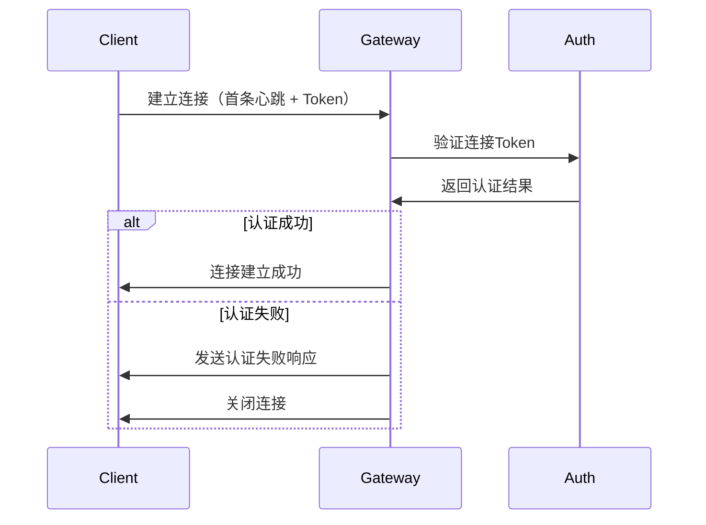
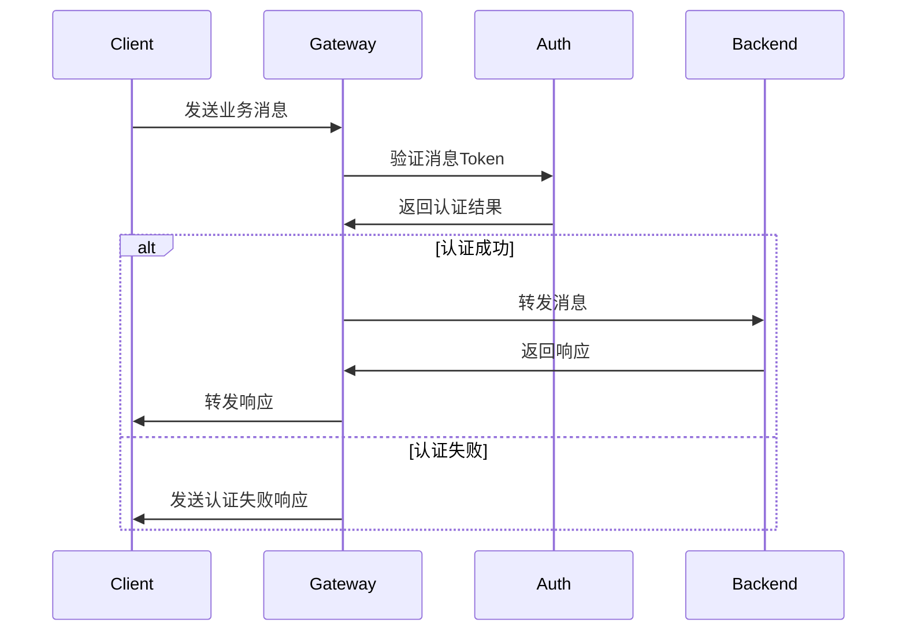

# 网关认证功能说明

## 功能概述

网关认证系统采用JWT Token机制，提供多层次的消息鉴权：

1. **连接认证**：在建立连接时验证玩家身份
2. **消息认证**：对指定类型的消息进行权限验证
3. **权限控制**：基于角色和等级的细粒度权限管理
4. **Token管理**：自动过期清理和刷新机制

## 配置说明

在 `config.yaml` 中添加认证配置：

```yaml
# 认证配置
auth:
  # 是否启用认证
  enabled: true
  # JWT密钥（生产环境请使用强密钥）
  secret_key: "mua-gatesvr-jwt-secret-key-2024-production"
  # Token过期时间（小时）
  token_expire_hours: 24
  # Token清理间隔（分钟）
  cleanup_interval_min: 10
  # 需要认证的消息类型
  require_auth:
    - "SERVICE_MESSAGE"  # 服务消息需要认证
  # 免认证的服务白名单
  whitelist_services:
    - "health"      # 健康检查服务
    - "version"     # 版本查询服务
  # 单玩家最大Token数量
  max_tokens_per_player: 3
  # 是否启用自动刷新Token
  enable_auto_refresh: true
  # 自动刷新阈值（分钟，当Token剩余有效期小于此值时自动刷新）
  refresh_threshold_min: 60
```

## Token结构

JWT Token包含以下载荷信息：

```json
{
  "player_id": "player123",     // 玩家ID
  "username": "张三",           // 用户名
  "level": 50,                  // 玩家等级
  "vip": 3,                     // VIP等级
  "login_time": 1703123456,     // 登录时间戳
  "expire_time": 1703209856,    // 过期时间戳
  "permissions": [              // 权限列表
    "service:userservice",
    "service:gameservice"
  ],
  "platform": "android",       // 登录平台
  "device_id": "device123",     // 设备ID
  "session_id": "session456"    // 会话ID
}
```

## 权限系统

### 权限格式

- `service:*` - 所有服务权限
- `service:userservice` - 特定服务权限
- `*` - 全部权限（管理员）

### 默认权限策略

```go
// 普通玩家
permissions := []string{
    "service:userservice",    // 用户服务
    "service:gameservice",    // 游戏服务
}

// VIP玩家 (vip > 0)
permissions = append(permissions, "service:vipservice")

// 高级玩家 (level >= 50)
permissions = append(permissions, "service:advancedservice")

// 管理员 (level >= 100)
permissions = []string{"service:*"}
```

## Token生成

### 1. 测试Token生成

```go
import "mua/gatesvr/internal/auth"

// 快速生成测试Token
token, err := auth.QuickGenerateToken("player123")
if err != nil {
    log.Printf("Token生成失败: %v", err)
    return
}
log.Printf("生成的Token: %s", token)
```

### 2. 正式Token生成

```go
// 创建Token生成器
generator := auth.NewTokenGenerator("your-secret-key")

// 生成玩家Token
permissions := auth.CreateDefaultPermissions(playerLevel, vipLevel)
token, err := generator.GeneratePlayerToken(
    "player123",    // 玩家ID
    "张三",         // 用户名
    50,             // 等级
    3,              // VIP等级
    permissions,    // 权限列表
    24,             // 过期时间（小时）
)
```

### 3. 特殊Token类型

```go
// 管理员Token（7天有效期，全部权限）
adminToken, err := generator.CreateAdminToken("admin001")

// 访客Token（2小时有效期，受限权限）
guestToken, err := generator.CreateGuestToken("guest001")
```

## Token验证

### 1. 基础验证

```go
// 验证Token
claims, err := auth.ValidatePlayerToken("player123", token)
if err != nil {
    log.Printf("Token验证失败: %v", err)
    return
}
log.Printf("验证成功，玩家: %s, 等级: %d", claims.PlayerID, claims.Level)
```

### 2. 批量验证

```go
// 批量验证多个Token
tokens := map[string]string{
    "player123": "token1...",
    "player456": "token2...",
}

generator := auth.NewTokenGenerator("")
results := generator.ValidateTokenBatch(tokens)
for playerID, valid := range results {
    log.Printf("玩家 %s Token验证结果: %v", playerID, valid)
}
```

## 消息认证流程

### 1. 连接建立认证



### 2. 消息处理认证



## 错误码说明

| 错误码 | 说明 | 处理建议 |
|--------|------|----------|
| 0 | 认证成功 | 正常处理 |
| 1001 | Token缺失 | 检查消息头是否包含Token |
| 1002 | Token无效 | 检查Token格式和签名 |
| 1003 | Token过期 | 重新登录获取新Token |
| 1004 | 玩家ID不匹配 | 检查Token是否属于当前玩家 |
| 1005 | 权限不足 | 检查玩家权限配置 |
| 1006 | 服务被禁用 | 联系管理员 |
| 1007 | 认证已禁用 | 正常处理（测试环境） |

## Token刷新机制

### 自动刷新

当Token剩余有效期小于配置的阈值时，系统会自动刷新：

```go
// 检查是否需要刷新
if needRefresh := auth.NeedTokenRefresh(claims); needRefresh {
    newToken, err := auth.RefreshToken(playerID)
    if err == nil {
        // 发送新Token给客户端
        log.Printf("Token已刷新: %s", newToken)
    }
}
```

### 手动刷新

```go
// 手动刷新Token
newToken, err := auth.RefreshToken("player123")
if err != nil {
    log.Printf("Token刷新失败: %v", err)
    return
}
log.Printf("新Token: %s", newToken)
```

## 监控和调试

### 1. Token信息查看

```go
// 打印Token详细信息
auth.PrintTokenInfo(token)

// 输出示例：
// === Token信息 ===
// Token: eyJhbGciOiJIUzI1NiIsInR5cCI6IkpXVCJ9...
// 有效性: true
// 剩余时间: 23h59m30s
// 创建时间: 2024-01-01 10:00:00
// 玩家ID: player123
// 用户名: 张三
// 等级: 50
// VIP: 3
// 权限: [service:userservice service:gameservice]
// 平台: android
// ===============
```

### 2. 缓存统计

```go
// 获取Token缓存统计
stats := auth.GetCacheStats()
log.Printf("缓存统计: %+v", stats)

// 输出示例：
// {
//   "total_requests": 1000,
//   "cache_hits": 850,
//   "cache_misses": 150,
//   "hit_rate": "85.00%",
//   "cached_tokens": 200
// }
```

### 3. 认证统计

```go
// 获取认证系统统计
authenticator := auth.GetAuthenticator()
stats := authenticator.GetAuthStats()
log.Printf("认证统计: %+v", stats)
```

## 客户端集成

### 1. 连接建立

```javascript
// WebSocket连接示例
const ws = new WebSocket('ws://localhost:6002/ws');

// 首条消息必须是心跳 + Token
const heartbeatMsg = {
    msg_head: {
        player_id: "player123",
        token: "your-jwt-token-here"
    },
    msg_type: 0, // HEARTBEAT
    payload: new TextEncoder().encode("heartbeat")
};

ws.onopen = function() {
    ws.send(JSON.stringify(heartbeatMsg));
};
```

### 2. 业务消息发送

```javascript
// 发送业务消息
const serviceMsg = {
    msg_head: {
        player_id: "player123",
        token: "your-jwt-token-here",
        service_name: "userservice",
        service_msg_type: 0 // SYNC
    },
    msg_type: 1, // SERVICE_MESSAGE
    payload: new TextEncoder().encode(JSON.stringify({
        action: "get_user_info",
        data: {}
    }))
};

ws.send(JSON.stringify(serviceMsg));
```

### 3. 错误处理

```javascript
// 处理认证失败
ws.onmessage = function(event) {
    const msg = JSON.parse(event.data);
    const payload = new TextDecoder().decode(msg.payload);
    
    if (payload.startsWith("AUTH_ERROR:")) {
        const [, errorCode, reason] = payload.split(":");
        console.error(`认证失败: ${reason} (${errorCode})`);
        
        if (errorCode === "1003") { // Token过期
            // 重新登录获取Token
            redirectToLogin();
        }
    }
};
```

## 性能优化

### 1. Token缓存

- 使用内存缓存避免重复验证
- 自动清理过期Token
- 命中率监控

### 2. 权限检查优化

- 权限列表预处理
- 通配符权限支持
- 服务白名单机制

### 3. 批量操作

```go
// 批量生成Token（测试场景）
generator := auth.NewTokenGenerator("")
playerIDs := []string{"player1", "player2", "player3"}
tokens := generator.BatchGenerateTokens(playerIDs)

// 导出到JSON
generator.ExportTokens(tokens, "test_tokens.json")
```

## 安全建议

### 1. 密钥管理

- 生产环境使用强密钥（至少32字符）
- 定期轮换密钥
- 密钥存储在安全位置

### 2. Token安全

- 设置合理的过期时间
- 启用HTTPS传输
- 避免在日志中记录Token

### 3. 权限控制

- 遵循最小权限原则
- 定期审核权限配置
- 监控异常权限使用

## 故障排除

### 1. 连接认证失败

**现象**: 客户端连接被拒绝
**排查步骤**:
1. 检查Token是否正确
2. 确认认证配置是否启用
3. 验证密钥配置
4. 查看服务器日志

### 2. 消息认证失败

**现象**: 业务消息被拒绝
**排查步骤**:
1. 检查消息类型是否需要认证
2. 验证权限配置
3. 确认服务白名单
4. 检查Token有效期

### 3. Token刷新失败

**现象**: 自动刷新不工作
**排查步骤**:
1. 检查自动刷新配置
2. 确认刷新阈值设置
3. 验证Token缓存状态
4. 查看刷新日志

### 4. 性能问题

**现象**: 认证延迟高
**排查步骤**:
1. 检查缓存命中率
2. 监控Token数量
3. 优化权限检查逻辑
4. 调整清理频率

## 测试用例

```go
// 测试Token生成和验证
func TestTokenFlow() {
    // 1. 生成Token
    token, err := auth.QuickGenerateToken("test_player")
    assert.NoError(t, err)
    
    // 2. 验证Token
    valid := auth.QuickValidateToken("test_player", token)
    assert.True(t, valid)
    
    // 3. 错误玩家ID验证
    valid = auth.QuickValidateToken("wrong_player", token)
    assert.False(t, valid)
}
```

## 最佳实践

1. **分环境配置**: 开发、测试、生产使用不同的密钥
2. **监控告警**: 对接监控系统，设置认证失败告警
3. **日志记录**: 记录关键认证事件，便于问题排查
4. **优雅降级**: 认证服务异常时的降级策略
5. **定期审计**: 定期检查权限配置和Token使用情况 